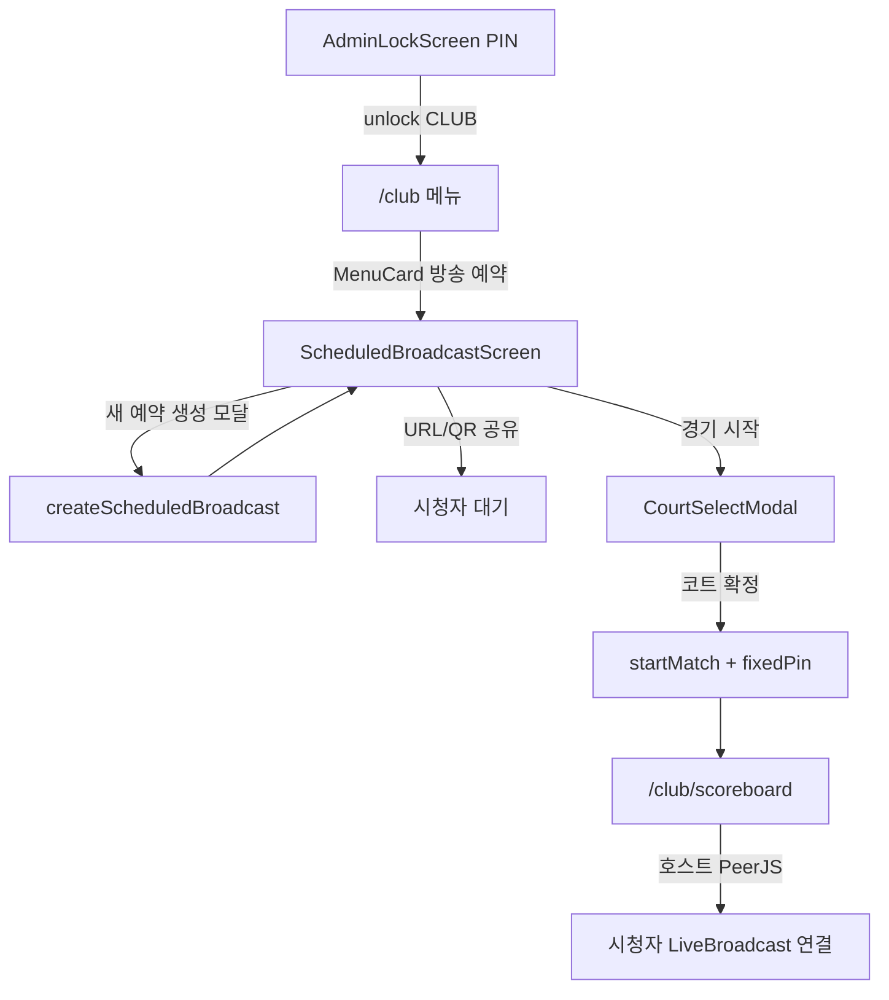
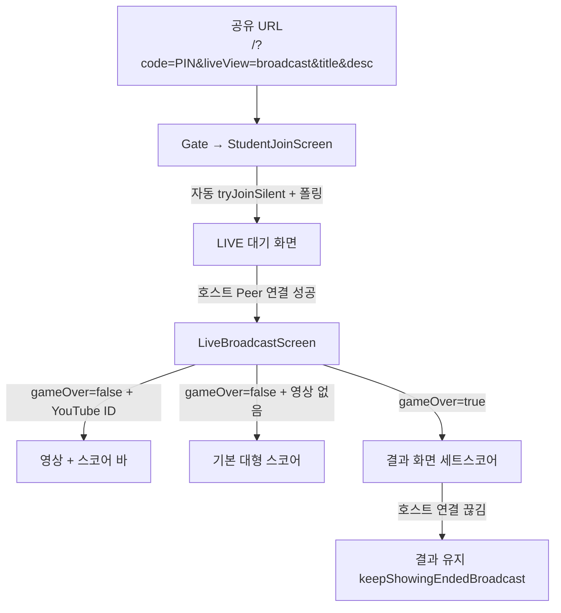

# J-IVE UX Flow (CLUB 중심)

> Google Stitch 등에 `Design.md`와 함께 넘길 **UX 흐름 컨텍스트**.  
> 코드에서 확인한 라우팅·화면 전환·렌더 구조만 정리했다. 추측성 개선안은 넣지 않았다.

**근거 파일:** `App.tsx`, `screens/MenuScreen.tsx`, `screens/ScheduledBroadcastScreen.tsx`, `screens/ScoreboardScreen.tsx`, `screens/StudentJoinScreen.tsx`, `screens/LiveBroadcastScreen.tsx`, `screens/AttendanceScreen.tsx`, `contexts/DataContext.tsx`, `components/LockScreen.tsx`

---

## 1. 화면 전환 흐름도 (CLUB)

### 1.0 진입·권한 게이트

```text
[/] Gate
  ├─ URL에 ?code= (또는 ?liveCode=) 있음
  │     → StudentJoinScreen (DataProvider appMode="CLASS"로 감쌈)
  │       · liveView=broadcast 이면 대기→LiveBroadcast
  │       · 아니면 연결 후 AnnouncerScreen (CLASS 기본)
  │
  └─ 코드 없음 → AdminLockScreen
        · PIN + CLASS/CLUB 토글 → sessionStorage unlockedMode
        · onUnlock → navigate('/club') 또는 '/class'
```

- Public: `/`, `/join` (ProtectedRoute 없음)
- Protected: `/club/*`, `/class/*` — 인증 실패 시 **리다이렉트 없이** `LockScreen` 오버레이
- CLUB에서 `teamBuilder` URL 진입 시 `useEffect`로 **자동 `menu` 리다이렉트** (`App.tsx`)
- `/club` 또는 `/club/` 에 `?code=` 있으면 **자동 `announcer` 뷰** → CLUB에선 `LiveBroadcastScreen`

---

### 1.1 관리자 여정 A — 방송 예약 → 전광판 (권장 CLUB 경로)



| 단계 | 화면 | 전환 트리거 |
|------|------|-------------|
| 1 | `AdminLockScreen` | PIN 성공 → `navigate('/club')` |
| 2 | `MenuScreen` | `onStartScheduledBroadcast` → `setView('scheduledBroadcast')` → `/club/scheduled-broadcast` |
| 3 | `ScheduledBroadcastScreen` | 「+ 새 예약 생성」→ `CreateScheduledBroadcastModal` → `createScheduledBroadcast` |
| 4 | 동일 화면 | 「코드/URL 복사」로 시청자 링크 공유 (`/?code=XXXX&liveView=broadcast&title=&desc=`) |
| 5 | 동일 화면 | 「경기 시작」→ `CourtSelectModal` → `onStartBroadcast` = `handleStartScheduledBroadcast` |
| 6 | — | `startMatch(..., { fixedPin: code, maxSets, tournamentTargetScore, ... })` — **MatchSetup/Attendance 스킵** 후 `setView('scoreboard')` |
| 7 | `ScoreboardScreen` | PeerJS 호스트 세션; QR은 `/?code=PIN&liveView=broadcast` |

`startMatch` 시 예약 상태가 `live`로 갱신되고, `gameOver` 시 `ended`로 바뀐다 (`DataContext` `markScheduledBroadcastLive` / ended 처리).

**수동 시작 변형:** 「코드 입력해서 경기 시작 (관리자)」→ `ManualStartModal` → 같은 `CourtSelectModal` → 전광판.

---

### 1.2 관리자 여정 B — 연습 경기 → 전광판

```text
메뉴 「🏐 연습 경기 시작」
  → PracticeOptionsModal (CLUB only, App.tsx onStartMatch)
  → MatchSetupScreen (팀 선택)
  → AttendanceScreen (선발/리베로 등)
  → handleStartMatchFromAttendance → startMatch
  → ScoreboardScreen
```

| 단계 | 트리거 |
|------|--------|
| 메뉴 CTA | `onStartMatch` → `setShowPracticeOptionsModal(true)` (CLUB) |
| 옵션 확정 후 | `setView('matchSetup')` + `entryMode='club'` |
| 팀 선택 | `MatchSetupScreen.onStartMatch` → `handleGoToAttendance` → `attendance` |
| 출전 확정 | `AttendanceScreen.onStartMatch` → `startMatch` → `scoreboard` |

---

### 1.3 관리자 여정 C — 리그 → 전광판 (CLUB 메뉴 실제 경로)

CLUB `MenuScreen`에서는 **대회(Competition) / 팀빌더 메뉴 카드가 숨겨진다** (`!isClub`).  
CLUB에서 보이는 주 경로는 메뉴 하단 **`LeagueStandingsDashboard`** 이다.

```text
메뉴 내 LeagueStandingsDashboard
  → 「실시간 점수 입력」 onStartLeagueLive(teamA, teamB, standingsId)
  → Attendance → startMatch → Scoreboard
```

**딥링크만 가능한 경로 (메뉴에 없음):** `/club/competition` → tournament / league-lobby → attendance → scoreboard  
(`handleStartTournamentMatch` / `handleStartLeagueMatch` → `handleGoToAttendance`)

---

### 1.4 시청자 여정 — URL → 대기 → 라이브 → 결과



| 단계 | 조건 | 동작 |
|------|------|------|
| URL 진입 | `code` + `liveView=broadcast` | `isBroadcastWaitMode` → 자동 조인, 호스트 없으면 3~5초 jitter 폴링 |
| 대기 UI | `isWaitingForHost && !p2p.isConnected` | 매치업 히어로 + 스피너 |
| 라이브 | `p2p.isConnected` 또는 (`gameOver` && broadcast) | `LiveBroadcastScreen` |
| 결과 | `matchState.gameOver` | `renderResultScreen()`; 연결 끊겨도 결과 유지 |
| 수동 조인 | 코드 없이 `/` 또는 `/join` | 코드 입력 → `handleJoin` → (broadcast면 Live, 아니면 Announcer) |

**메뉴에서 관리자가 「실시간 세션 참여」:** 조인 모달 → `joinSession` 성공 → `onStartAnnouncer` → CLUB면 `LiveBroadcastScreen`.

---

### 1.5 전광판(호스트) ↔ 시청자 동기화 시점

호스트 `ScoreboardScreen`에서 `dispatch` / 설정 변경 시 `DataContext`가 PeerJS로 브로드캐스트:

| 호스트 액션 | 메시지 타입 (예시) | 시청자 반영 |
|-------------|-------------------|-------------|
| 득점·스탯·세트·교체 등 | `action` 또는 `full_state_sync` | `matchState` → 스코어/결과 |
| 시청자 신규 접속 | `full_state_sync` + settings/chat/video | 즉시 전체 상태 |
| YouTube ID 설정 | `broadcast_video_sync` | iframe 레이어 |
| 자막 | `ticker_sync` | (수신측 UI에 따라) |
| 이펙트 | `effect_broadcast` | 이펙트 팝업 |
| 채팅 ON/OFF·창 표시 | `chat_enabled_sync`, `chat_visibility_sync` | LiveBroadcast 채팅 허용 |
| 채팅/리액션 | `chat_broadcast`, `REACTION` / `reaction_broadcast` | 채팅창·플로팅 이모지 |
| 시청자 수 | `viewer_count_sync` | 전광판 「👀 N명」 |

경기 종료 후 메뉴로: `navigateToMenu` → `closeSession()` + `setView('menu')`.

---

## 2. 화면별 정보 우선순위 (코드 기준)

밀도 기준: **메인 뷰에 동시에 보이는 클릭/입력 가능 요소** 대략치.  
파일 내 `<button>` 태그 수(모달 포함)는 참고용으로 병기.

| 화면 | 밀도 | 파일 내 button 대략 | 메인 뷰 체감 |
|------|------|-------------------|--------------|
| `ScoreboardScreen` | **HIGH** | ~95 (모달 포함) | 전광판 본문에 팀당 다수 CTA + 상단 툴바 |
| `ScheduledBroadcastScreen` | **MEDIUM–HIGH** | ~43 (생성/수동 모달 포함) | 리스트당 3~5개 CTA |
| `LiveBroadcastScreen` | **LOW–MEDIUM** | ~11 | UI 숨김 시 1개; 채팅 열면 증가 |
| `StudentJoinScreen` | **LOW** | ~4 | 대기: 1; 코드 입력: 2 |

---

### 2.1 ScoreboardScreen — **HIGH**

**시각적 1순위 (가장 큼)**

- 팀 점수: `text-5xl → xl:text-9xl` `font-extrabold` (`TeamColumn`)
- `+/-` 점수 버튼: `text-xl sm:text-2xl`, `min-h-[44px]`, 빨강/초록 전폭
- 중앙 타이머: `text-2xl → lg:text-4xl` `font-black` (토글 클릭)

**렌더 상단→하단 블록 (진행 중 기준)**

1. 상단 바: PIN/QR · 타이머 · 전술판 · 라이브 중계 · 대회 전광판 토글 · 채팅 토글 · 시청자 수
2. (CLUB) 자막 입력 / 이펙트 버튼 영역
3. 양팀 `TeamColumn` 그리드: 팀명 · 점수 · +/− · 서브 시작 · 스탯 버튼 그리드(에이스, 서브 In, 스파이크, 블로킹, 범실, 작전타임 등)
4. 하단: 교체 · 리베로 퀵교체(조건부) · Undo · 세트/경기 종료 등
5. 오버레이 모달: 선수선택, 히트맵, 교체, 타임아웃, QR 확대, 전술판, YouTube 설정, 서브순서 …

**인터랙션 밀도**

- 팀당 스탯/점수 버튼만으로도 **십수 개**가 항상 노출.
- 모달 진입점도 상단·하단·팀 헤더에 분산 → **운영용 고밀도 콘솔**.

---

### 2.2 LiveBroadcastScreen — **LOW–MEDIUM** (관전 전용)

**레이어 우선순위**

1. `gameOver` → 결과 화면 (승리 팀명 `text-3xl sm:text-5xl font-black`, 세트스코어 `text-5xl sm:text-7xl`)
2. else `broadcastVideoId` → YouTube **풀스크린 iframe**
3. else 기본 스코어 (`text-6xl sm:text-8xl` 점수 + 최근 득점 리스트)

**오버레이 (pointer-events 분리)**

| 요소 | 크기/위치 | 역할 |
|------|-----------|------|
| UI 숨기기/표시 | 우상단 고정 | 유일한 상시 컨트롤 |
| 스코어 바 | 상단 (영상 있을 때만) | 점수 `text-3xl sm:text-6xl` |
| 득점 토스트 | 하단 중앙 | 자동 3.5초 |
| 채팅 / 리액션 | 우하단 | 호스트가 채팅 허용 시에만 |

**메인 뷰 인터랙션 (대략)**

- UI 접힘: **1** (토글)
- UI + 채팅: UI토글 + 최소화 + 입력 + 전송 + 이모지 3 ≈ **7**
- 결과 화면: **거의 0** (읽기 전용)

→ 시청 경험은 **저밀도**, 전광판과 대비 명확.

---

### 2.3 StudentJoinScreen — **LOW**

**상태별 우선순위**

| 상태 | 1순위 정보 | 인터랙션 |
|------|-----------|----------|
| `isWaitingForHost` | 매치업 `text-xl sm:text-2xl font-extrabold` + LIVE 대기 배지 | 「돌아가기」1 + 폴링 자동 |
| 코드 입력 | 제목 + PIN 입력 `text-lg` + emerald CTA | input 1 + 참여 버튼 1 |
| 연결됨 | 즉시 `LiveBroadcastScreen`로 이관 | (이 파일 밖으로) |

정보 밀도 **낮음** — 대기/입장에 집중.

---

### 2.4 ScheduledBroadcastScreen — **MEDIUM–HIGH**

**시각적 1순위**

- 페이지 타이틀 `text-2xl font-bold text-sky-400`
- 예약 카드의 **코드** `text-2xl font-black text-yellow-400` + QR `96×96`
- 상단 CTA: 「새 예약 생성」(sky) · 「코드 입력해서 경기 시작」(amber)

**카드당 노출 CTA (scheduled/live)**

- 코드 복사, URL 복사, 경기 시작, (scheduled면) 취소 → **3~4개**
- 예약 N개면 선형으로 밀도 증가

**모달 (열릴 때만 HIGH)**

- 생성: 다수 인풋 + 팀 피커
- 수동 시작 / 코트 선택: 확인·취소 패턴

---

## 3. 반복되는 인터랙션 패턴

### 3.1 모달 열기

공통 패턴:

1. 로컬 `useState` (`showX`, `pendingAction`, `pendingStart` …)
2. 오버레이: `fixed inset-0 … bg-black/60|70|80` + `z-[100]` ~ `z-[200]` / Portal 시 `z-[99999]`
3. 내부 클릭 `stopPropagation`, 배경 클릭 시 닫기(모달마다 상이)
4. 열림 중 `document.body.style.overflow = 'hidden'`

대표:

| 패턴 | 예 |
|------|----|
| 메뉴 확인 | `ConfirmationModal` (취소 slate / 확인 red) |
| 방송 예약 | `CreateScheduledBroadcastModal`, `ManualStartModal`, `CourtSelectModal` (`z-[200]`) |
| 전광판 | `PlayerSelectionModal`, `SubstitutionModal`, `HeatmapRecordModal`, QR 확대, YouTube 설정 |
| 전역 잠금 | Header 잠금 → `isAppLocked` 오버레이 `z-[9999]` |

### 3.2 확인 / 취소

- **양버튼:** 취소 `bg-slate-700` + 확정(색: sky/amber/emerald/red)
- **단방향 닫기:** 모달 X / 배경 클릭
- **Undo:** 전광판 `dispatch({ type: 'UNDO' })` — `window.confirm` 없이 즉시 (코드 주석)
- **토스트 피드백:** `showToast(msg, 'success'|'error')` → 하단 중앙 `Toast` 2.5초; 자동저장은 `AutoSaveToast` 우상단
- **시청자 득점 토스트:** `LiveBroadcastScreen`의 `toastText`는 DataContext Toast와 **별개** 로컬 상태(득점 이벤트 감지, 약 3.5초)

### 3.3 실시간 동기화 패턴

```text
[호스트 Scoreboard]
  dispatch / sendTicker / sendBroadcastVideoId / setChatEnabled …
       ↓
DataContext.broadcast(conn.send)
       ↓
[시청자 StudentJoin → LiveBroadcast]
  matchState / broadcastVideoId / chat / reactions 구독 렌더
```

- **즉시 반영:** 점수·세트·서브권·타임아웃·코트스왑(`isSwapped`)·채팅·리액션·영상 ID
- **접속 시 일괄:** `full_state_sync`로 늦게 들어온 시청자 맞춤
- **예약 대기:** 호스트 미기동 시 시청자는 폴링만 하고 UI는 대기 고정

### 3.4 네비게이션·세션

| 패턴 | 동작 |
|------|------|
| View 전환 | `setView` → `navigate(/club/{segment})` |
| 메뉴 복귀 | `closeSession()` + 관련 state 클리어 |
| PIN/QR | 호스트 `peerId`에서 `jive-` 제거한 4자리; CLUB QR에 `liveView=broadcast` |
| 모드 잠금 | `unlockedMode` master/class/club — 경로 불일치 시 LockScreen |
| 키오스크 | 학생 뷰에서 관리자 이탈 버튼 최소화/제거 (StudentJoin 연결 후 등) |

### 3.5 CLUB 메뉴에서 자주 쓰는 진입점

| CTA | 다음 |
|-----|------|
| 연습 경기 시작 | PracticeOptions → MatchSetup → Attendance → Scoreboard |
| 방송 예약 | ScheduledBroadcast → (공유) / 경기시작 → Scoreboard |
| 실시간 세션 참여 | 조인 모달 → Announcer 뷰 = LiveBroadcast |
| 팀 관리 / 히트맵 / 전술판 / 설정 | 각 전용 화면·모달 |

---

## Appendix — Stitch용 한 줄 요약

> CLUB UX splits into **dense host Scoreboard console** vs **sparse viewer LiveBroadcast**. Admin path: Lock → Menu → ScheduledBroadcast (QR share) → CourtSelect → Scoreboard (PeerJS host). Viewer path: `/?code&liveView=broadcast` → wait polling → LiveBroadcast (score/YouTube/result). Sync is host-push via PeerJS (`full_state_sync` / actions / chat / video).

---

## TODO (직접 채울 자리)

- [ ] Stitch에 개선 요청할 화면 우선순위:
- [ ] 시청자 대기/라이브에서 바꾸고 싶은 UX:
- [ ] 전광판에서 줄이고 싶은 버튼/그룹:
- [ ] 유지해야 할 체육관 제약 (터치, 거리, 밝기 등):
